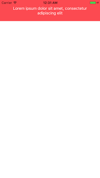
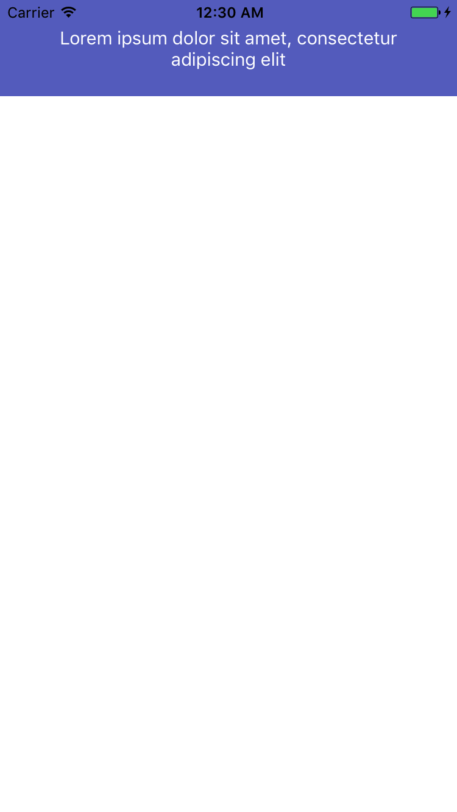
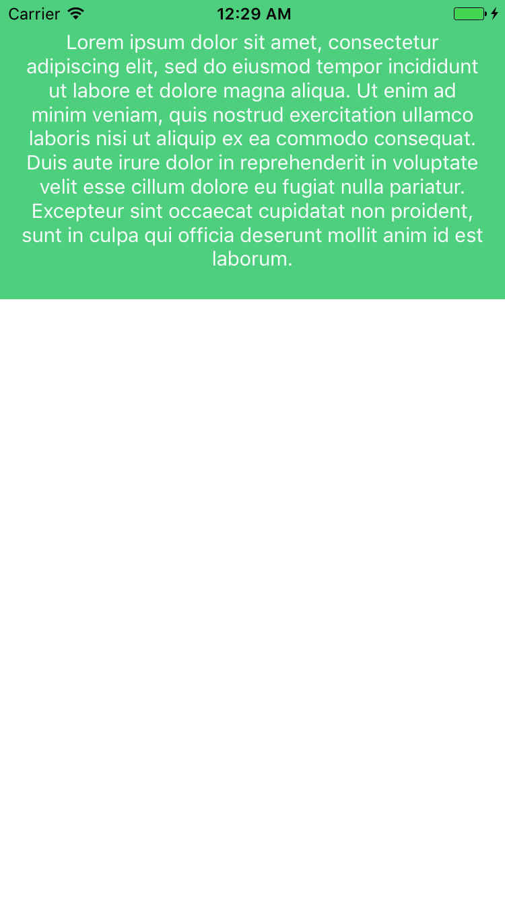

# Kiwi-Notification-View

stylish modern and flat Notification view that is very simple to integrate and very easy to use. 





## Getting Started

only manual way is available now. 
all you have to do is to add KiwiNotificationView.swift and KiwiNotificationView.xib files to your project and you are ready to do ;)

### Prerequisites

xcode 8
swift 3 

```
let kiwiView = KiwiNotificationView.instanceFromNib()
kiwiView.showNotification(view: self.view, message: "Congrats, that's all you need to make me work!", state: kiwiStates.success)
```
for custom back ground color 

```
kiwiView.showNotification(view: self.view, message: "Congrats, that's all you need to make me work!", color : UIColor.red)
```
by deafult all durations to show up is 0.5 if need to change the duration

```
func showNotification(view : UIView, message : String, color : UIColor?, state : kiwiStates, duration : Double) 
```
Kiwi notification states 

```
enum kiwiStates : Int {

	case success = 0
	case cuteSuccess = 1
	case error = 2
	case warning = 3
	case custom = 4
}
```

## Authors

* **Ahmed Hegazi** 

## TO DO

1. adding actions to the notification view.
2. adding icons to the view.
3. documentation

please feel free to open or report issues also, let me know if you used it ;)
